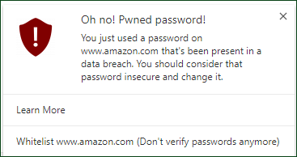
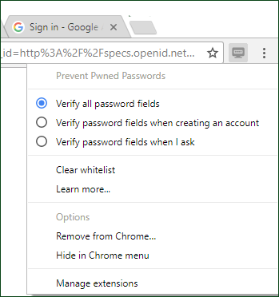

# Prevent Pwned Passwords

Prevent Pwned Passwords is a Chrome extension that helps make sure you don't use any password that's known to have been part of a data breach.

## How does it work?

To get started, install the Prevent Pwned Passwords from the Chrome Web Store.

Once installed, whenever you enter a password on any page, that password will automatically be verified against Have I Been Pwned, a service that keeps track of passwords that are known to have been compromised. If the password you enter has been in a prior breach, a notification will appear on screen. The notifications look like this:

While some people might like these constant reminders of bad passwords, you might find it a bit too naggy. There are a few options to better manage these notifications, which you can find by clicking on the Prevent Pwned Passwords icon:

* "Verify all password fields" is the default configuration, and checks all password fields.
* "Verify password fields when creating an account" will only verify passwords on page that look like they are for creating an account (or resetting a password). We can't always correctly determine these pages, but we look for pages that have two password fields (a password and a confirm field).
* "Verify password fields when I ask" doesn't automatically check any passwords. But you can right-click on any password field and choose "Has this password been pwned" from the menu to explicitly choose to verify a password. (This option is also available even if you also have password fields verified automatically.)

Additionally, whenever a notification appears, you can choose to whitelist the domain. By whitelisting it, we'll no longer check any passwords you enter on that domain.

## What should I do if I get a notification that my password has been in a breach?

You should change that password to something more secure.

## If my password has been in a breach, does this mean that I've been hacked?

No. What it means is that the password you used has been leaked in some prior data breach. It doesn't necessarily mean that your account was involved in a breach -- someone else could have used the same password as you. But because that password was leaked at some point by some site, it's much more likely to be compromised now -- so much so that you simply shouldn't use that password anymore.

## Wait, so my password could be compromised even if it was someone else's account (who had the same password as me) was hacked?

Yes. A common method that malicious hackers use is called a "brute force" attack. They use an automated process to try every possible combination of characters as a password. Imagine trying to guess passwords for a user -- you could start with "aaaaaa", then try "aaaaab", then "aaaaac", and so on until you guessed the right one. This is the basic idea behind a brute force attack.

To make a brute force attack more efficient, hackers will often begin by using a dictionary of known passwords -- the same list of passwords that we verify against. So any password that has been compromised (even if it was breached from someone else's account) is much more likely to be guessed by a brute force attack.

## How do you keep my password safe?

Our [privacy policy](privacy-policy.md) explains this in more depth. The goal of Prevent Pwned Passwords is to make you more secure, so we are very careful with your data.

## What is "Have I Been Pwned"? Why do they have a list of compromised passwords?

[Have I Been Pwned](https://haveibeenpwned.com) is a service that monitors data breaches to help people know when an account of theirs may have been compromised or hacked. They do not store passwords, and are very carefully about how the data they collect is managed and secured. You can read more about that on their [About page](https://haveibeenpwned.com/About).

## Who created this app and why?

It was created by [Chris Wilson](https://www.xaipete.net) to help people stay a bit safer online.
